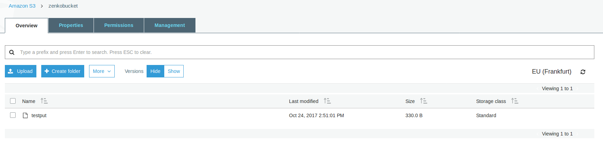
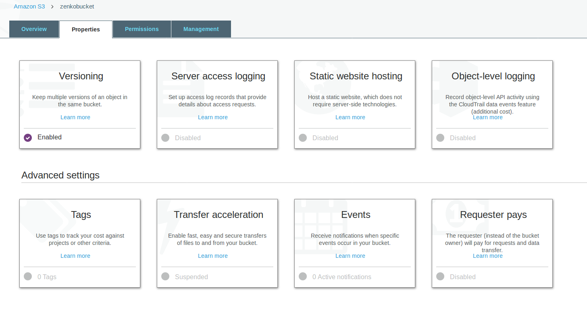
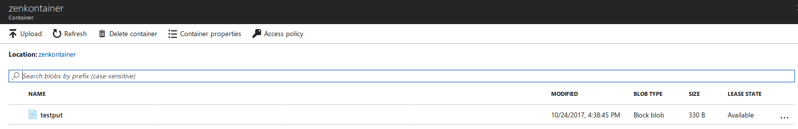
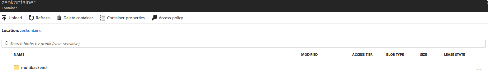
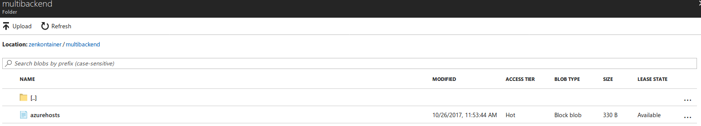
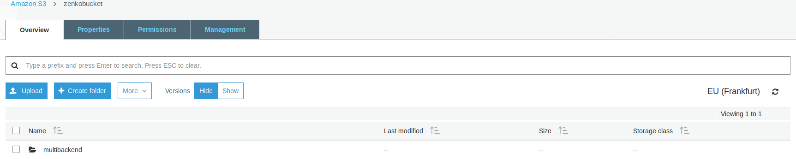
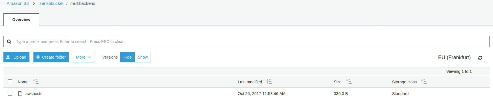

Using Public Clouds as backends
===============================

Introduction
------------

As stated in our `GETTING STARTED guide <../GETTING_STARTED/#location-configuration>`__,
new backends can be added by creating a region (also called location constraint)
with the right endpoint and credentials.
This section of the documentation shows you how to set up our currently
supported public cloud backends:

- `Amazon S3 <#aws-s3-as-a-backend>`__ ;
- `Microsoft Azure <#microsoft-azure-as-a-backend>`__ .

For all Public Cloud backends, you'll have to do some editing inside the
repository, and some editing from the Public Cloud Console.

.. IMPORTANT::
   CloudServer also enables you to have, within the same local bucket, objects
   stored to different backends (both private and public clouds, for example).
   This is an advanced usecase, and it will require that you set your backends
   as explained below. Once this is done, you may refer to the
   `backend configuration at object level <#backend-configuration-at-object-level>`__
   section of this document.

AWS S3 as a backend
-------------------

From the AWS S3 Console
~~~~~~~~~~~~~~~~~~~~~~~

Create a bucket where you will host your data for this new location constraint.
This bucket must have versioning enabled. This is an option you may choose to
activate at step 2 of Bucket Creation in the console.
In this example, our bucket will be name ``zenkobucket`` and has versioning
enabled.

From the CloudServer repository
~~~~~~~~~~~~~~~~~~~~~~~~~~~~~~~

locationConfig.json
^^^^^^^^^^^^^^^^^^^

Edit this file to add a new region, which should describe the AWS S3 hosted
bucket you'll be writing your data to. There are a few configurable options here:

- :code:`type` : set to :code:`aws_s3` to indicate this region is hosted in AWS S3;
- :code:`legacyAwsBehavior` : set to :code:`true` to indicate this region should
  behave like AWS S3 :code:`us-east-1` region, set to :code:`false` to indicate
  this region should behave like any other AWS S3 region;
- :code:`bucketName` : set to an *existing bucket* in your AWS S3 Account; this
  is the bucket that will host all the data written in this region;
- :code:`awsEndpoint` : set to your bucket's endpoint, usually :code:`s3.amazonaws.com`;
- :code:`bucketMatch` : set to :code:`true` if you want your object name to be the
  same in your local bucket and your AWS S3 bucket; set to :code:`false` if you
  want your object name to be of the form :code:`{{localBucketName}}/{{objectname}}`
  in your AWS S3 hosted bucket;
- :code:`credentialsProfile` and :code:`credentials` are two ways to provide
  your AWS S3 credentials for that bucket, *use only one of them* :
  - :code:`credentialsProfile` : set to the profile name allowing you to access
    your AWS S3 bucket from your :code:`~/.aws/credentials` file;
  - :code:`credentials` : set the two fields inside the object (:code:`accessKey`
    and :code:`secretKey`) to their respective values from your AWS credentials.

.. code:: json

    (...)
    "aws-test": {
        "type": "aws_s3",
        "legacyAwsBehavior": true,
        "details": {
            "awsEndpoint": "s3.amazonaws.com",
            "bucketName": "zenkobucket",
            "bucketMatch": true,
            "credentialsProfile": "zenko"
        }
    },
    (...)

.. code:: json

    (...)
    "aws-test": {
        "type": "aws_s3",
        "legacyAwsBehavior": true,
        "details": {
            "awsEndpoint": "s3.amazonaws.com",
            "bucketName": "zenkobucket",
            "bucketMatch": true,
            "credentials": {
                "accessKey": "WHDBFKILOSDDVF78NPMQ",
                "secretKey": "87hdfGCvDS+YYzefKLnjjZEYstOIuIjs/2X72eET"
            }
        }
    },
    (...)

.. WARNING::
   If you set :code:`bucketMatch` to :code:`true`, we strongly advise for having
   only one local bucket per AWS S3 location. Indeed, since your objects names
   won't be prefixed by the local bucket name in the AWS S3 bucket, you could
   create inconsistencies seamlessly by putting two objects with the same name
   in two different local buckets, but since they are ultimately saved in the
   same AWS bucket, the most recent one would overwrite the earlier one, as the
   namespace will conflict.

config.json
^^^^^^^^^^^

Edit the :code:`restEndpoint` section of your :code:`config.json` file to add
an endpoint definition matching your new AWS S3 hosted region. Following our
previous example, it would look like:

.. code:: json

    (...)
        "restEndpoints": {
        "localhost": "us-east-1",
        "127.0.0.1": "us-east-1",
        "cloudserver-front": "us-east-1",
        "s3.docker.test": "us-east-1",
        "127.0.0.2": "us-east-1",
        "s3.amazonaws.com": "aws-test"
    },
    (...)

~/.aws/credentials
^^^^^^^^^^^^^^^^^^

.. TIP::
   If you set the :code:`credentials` object in your
   :code:`locationConfig.json` file, you may skip this section

Make sure your :code:`~/.aws/credentials` file has a profile matching the one
defined in your :code:`locationConfig.json`. Following our previous example, it
would look like:

.. code:: shell

    [zenko]
    aws_access_key_id=WHDBFKILOSDDVF78NPMQ
    aws_secret_access_key=87hdfGCvDS+YYzefKLnjjZEYstOIuIjs/2X72eET

Start the server with the ability to write to AWS S3
~~~~~~~~~~~~~~~~~~~~~~~~~~~~~~~~~~~~~~~~~~~~~~~~~~~~

Inside the repository, once all the files have been edited, you should be able
to start the server and start testing pushing to AWS S3.

.. code:: shell

   # Start the server locally
   $> S3DATA=multiple npm start

Run the server as a docker container with the ability to write to AWS S3
~~~~~~~~~~~~~~~~~~~~~~~~~~~~~~~~~~~~~~~~~~~~~~~~~~~~~~~~~~~~~~~~~~~~~~~~

.. TIP::
   If you set the :code:`credentials` object in your
   :code:`locationConfig.json` file, you don't need to mount your
   :code:`.aws/credentials` file

Mount all the files that have been edited to override defaults, and do a
standard Docker run; then you can start testing pushing to AWS S3.

.. code:: shell

   # Start the server in a Docker container
   $> sudo docker run -d --name CloudServer \
   -v $(pwd)/data:/usr/src/app/localData \
   -v $(pwd)/metadata:/usr/src/app/localMetadata \
   -v $(pwd)/locationConfig.json:/usr/src/app/locationConfig.json \
   -v $(pwd)/conf/authdata.json:/usr/src/app/conf/authdata.json \
   -v ~/.aws/credentials:/root/.aws/credentials \
   -e S3DATA=multiple -e ENDPOINT=http://localhost -p 8000:8000
   -d scality/s3server

Testing: put an object to AWS S3 using CloudServer
~~~~~~~~~~~~~~~~~~~~~~~~~~~~~~~~~~~~~~~~~~~~~~~~~~

In order to start testing pushing to AWS S3, you will need to create a local
bucket in the AWS S3 location constraint - this local bucket will only store the
metadata locally, while both the data and the metadata will be stored on AWS S3.
This example is based on all our previous steps.

.. code:: shell

   # Create a local bucket hosting data in AWS S3
   $> s3cmd --host=127.0.0.1:8000 mb s3://zenkobucket --region=aws-test
   # Put an object to AWS S3, and store the metadata locally
   $> s3cmd --host=127.0.0.1:8000 put /etc/hosts s3://zenkobucket/testput
    upload: '/etc/hosts' -> 's3://zenkobucket/testput'  [1 of 1]
     330 of 330   100% in    0s   380.87 B/s  done
   # List locally to check you have the metadata
   $> s3cmd --host=127.0.0.1:8000 ls s3://zenkobucket
    2017-10-23 10:26       330   s3://zenkobucket/testput

Then, from the AWS Console, if you go into your bucket, you should see your
newly uploaded object:

Troubleshooting
~~~~~~~~~~~~~~~

Make sure your :code:`~/.s3cfg` file has credentials matching your local
CloudServer credentials defined in :code:`conf/authdata.json`. By default, the
access key is :code:`accessKey1` and the secret key is :code:`verySecretKey1`.
For more informations, refer to our template `~/.s3cfg <./CLIENTS/#s3cmd>`__ .

Pre existing objects in your AWS S3 hosted bucket can unfortunately not be
accessed by CloudServer at this time.

Make sure versioning is enabled in your remote AWS S3 hosted bucket. To check,
using the AWS Console, click on your bucket name, then on "Properties" at the
top, and then you should see something like this:

Microsoft Azure as a backend
----------------------------

From the MS Azure Console
~~~~~~~~~~~~~~~~~~~~~~~~~

From your Stoage Account dashboard, create a container where you will host your
data for this new location constraint.

You will also need to generate a SAS (Shared Access Signature) from the Console.
This can be done from your Storage Account dashboard, under "Settings, then
"Shared access signature". Your SAS will expire after some time. You can give it
different permissions.
Once you click "Generate SAS", a "SAS token" and a "Blob service SAS URL" will
appear. You want to use the **SAS token without the initial question mark**.

In this example, our container will be name ``zenkontainer``, and will belong to
the ``zenkomeetups`` Storage Account.

From the CloudServer repository
~~~~~~~~~~~~~~~~~~~~~~~~~~~~~~~

locationConfig.json
^^^^^^^^^^^^^^^^^^^

Edit this file to add a new region, which should describe the MS Azure hosted
container you'll be writing your data to. There are a few configurable options
here:

- :code:`type` : set to :code:`azure` to indicate this region is hosted in MS Azure;
- :code:`legacyAwsBehavior` : set to :code:`true` to indicate this region should
  behave like AWS S3 :code:`us-east-1` region, set to :code:`false` to indicate
  this region should behave like any other AWS S3 region (in the case of MS Azure
  hosted data, this is mostly relevant for the format of errors);
- :code:`azureBlobEndpoint` : set to your storage account's endpoint, usually
  :code:`https://{{storageAccountName}}.blob.core.windows.name`;
- :code:`azureContainerName` : set to an *existing container* in your MS Azure
  storage account; this is the container that will host all the data written in
  this region;
- :code:`bucketMatch` : set to :code:`true` if you want your object name to be
  the same in your local bucket and your MS Azure container; set to
  :code:`false` if you want your object name to be of the form
  :code:`{{localBucketName}}/{{objectname}}` in your MS Azure container ;
- :code:`azureBlobSAS` : provide a generated Shared Access Signature *without*
  the initial question mark.

.. code:: json

    (...)
    "azure-test": {
	"type": "azure",
        "legacyAwsBehavior": false,
        "details": {
          "azureBlobEndpoint": "https://zenkomeetups.blob.core.windows.net/",
	  "bucketMatch": true,
	  "azureBlobSAS": "sv=2017-04-17&ss=b&srt=o&sp=l&se=2017-10-25T14:51:55Z&st=2017-10-25T12:51:55Z&spr=https&sig=98sQIRPxvHerHeUvlCoq0cpSpf0lZK6qiZn9kPFHpeM%U8",
	  "azureContainerName": "zenkontainer"
	}
    },
    (...)

.. WARNING::
   If you set :code:`bucketMatch` to :code:`true`, we strongly advise for having
   only one local bucket per MS Azure location. Indeed, since your objects names
   won't be prefixed by the local bucket name in the MS Azure container, you
   could create inconsistencies seamlessly by putting two objects with the same
   name in two different local buckets, but since they are ultimately saved in
   the same MS Azure container, the most recent one would overwrite the earlier
   one, as the namespace will conflict.

Start the server with the ability to write to MS Azure
~~~~~~~~~~~~~~~~~~~~~~~~~~~~~~~~~~~~~~~~~~~~~~~~~~~~~~

Inside the repository, once all the files have been edited, you should be able
to start the server and start testing pushing to MS Azure.

.. code:: shell

   # Start the server locally
   $> S3DATA=multiple npm start

Run the server as a docker container with the ability to write to MS Azure
~~~~~~~~~~~~~~~~~~~~~~~~~~~~~~~~~~~~~~~~~~~~~~~~~~~~~~~~~~~~~~~~~~~~~~~~~~

Mount all the files that have been edited to override defaults, and do a
standard Docker run; then you can start testing pushing to MS Azure.

.. code:: shell

   # Start the server in a Docker container
   $> sudo docker run -d --name CloudServer \
   -v $(pwd)/data:/usr/src/app/localData \
   -v $(pwd)/metadata:/usr/src/app/localMetadata \
   -v $(pwd)/locationConfig.json:/usr/src/app/locationConfig.json \
   -v $(pwd)/conf/authdata.json:/usr/src/app/conf/authdata.json \
   -e S3DATA=multiple -e ENDPOINT=http://localhost -p 8000:8000
   -d scality/s3server

Testing: put an object to MS Azure using CloudServer
~~~~~~~~~~~~~~~~~~~~~~~~~~~~~~~~~~~~~~~~~~~~~~~~~~~~

In order to start testing pushing to MS Azure, you will need to create a local
bucket in the MS Azure region - this local bucket will only store the metadata
locally, while both the data and the metadata will be stored on MS Azure.
This example is based on all our previous steps.

.. code:: shell

   # Create a local bucket hosting data in MS Azure
   $> s3cmd --host=127.0.0.1:8000 mb s3://zenkontainer --region=azure-test
   # Put an object to MS Azure, and store the metadata locally
   $> s3cmd --host=127.0.0.1:8000 put /etc/hosts s3://zenkontainer/testput
    upload: '/etc/hosts' -> 's3://zenkontainer/testput'  [1 of 1]
     330 of 330   100% in    0s   380.87 B/s  done
   # List locally to check you have the metadata
   $> s3cmd --host=127.0.0.1:8000 ls s3://zenkobucket
    2017-10-24 14:38       330   s3://zenkontainer/testput

Then, from the MS Azure Console, if you go into your container, you should see
your newly uploaded object:

Troubleshooting
~~~~~~~~~~~~~~~

Make sure your :code:`~/.s3cfg` file has credentials matching your local
CloudServer credentials defined in :code:`conf/authdata.json`. By default, the
access key is :code:`accessKey1` and the secret key is :code:`verySecretKey1`.
For more informations, refer to our template `~/.s3cfg <./CLIENTS/#s3cmd>`__ .

Pre existing objects in your MS Azure container can unfortunately not be
accessed by CloudServer at this time.

Backend configuration at object level
-------------------------------------

If you configured regions in public clouds as explained above, you may create
local buckets that will host both the data and the metadata for local objects,
and the metadata only for objects hosted in public clouds.
This is done by adding a custom header : :code:`x-amz-meta-scal-location-constraint`
at object PUT time, and setting the value of that header to the region name you
wish to store the objects to.

.. WARNING::
   We strongly advise that you set the :code:`bucketMatch` option of your public
   locations to :code:`false` in your :code:`locationConfig.json`, to prevent
   any namespace conflict by prefixing your objects in the public clouds with
   the local bucket name.

Testing: create a local bucket with objects hosted in different backends
~~~~~~~~~~~~~~~~~~~~~~~~~~~~~~~~~~~~~~~~~~~~~~~~~~~~~~~~~~~~~~~~~~~~~~~~

Context and reminders
^^^^^^^^^^^^^^^^^^^^^

In this example, we'll have a local bucket :code:`multibackend` store objects
locally, to MS Azure, and to AWS S3. Contrary to the examples in the above
sections, the parameter :code:`bucketMatch` is set to :code:`false` for both
the :code:`azure` and the :code:`aws` regions, which point to the same bucket
and container as before otherwise.
This is what our :code:`locationConfig.json` looks like:

.. code:: json

   {
       "us-east-1": {
           "type": "file",
           "legacyAwsBehavior": true,
           "details": {}
       },
       "aws": {
           "type": "aws_s3",
           "legacyAwsBehavior": false,
           "details": {
               "awsEndpoint": "s3.amazonaws.com",
               "bucketName": "zenkobucket",
               "bucketMatch": false,
               "credentialsProfile": "zenko"
           }
       },
       "azure": {
           "type": "azure",
           "legacyAwsBehavior": false,
           "details": {
             "azureBlobEndpoint": "https://zenkomeetups.blob.core.windows.net/",
             "bucketMatch": false,
             "azureBlobSAS": "sv=2017-04-17&ss=b&srt=o&sp=l&se=2017-10-25T14:51:55Z&st=2017-10-25T12:51:55Z&spr=https&sig=98sQIRPxvHerHeUvlCoq0cpSpf0lZK6qiZn9kPFHpeM%U8",
             "azureContainerName": "zenkontainer"
           }
       }
   }

Example test
^^^^^^^^^^^^

.. code:: shell

   # Create local bucket (no region specified, defaults to us-east-1)
   $> s3cmd --host=127.0.0.1:8000 mb s3://multibackend
    Bucket 's3://multibackend/' created
   # Put an object hosted locally in multibackend bucket
   $> s3cmd --config=.s3cfg --host=127.0.0.1:8000 put /etc/hosts s3://multibackend/localhosts
    upload: '/etc/hosts' -> 's3://multibackend/localhosts'  [1 of 1]
     330 of 330   100% in    0s     8.84 kB/s  done
   # Put an object hosted on MS Azure in multibackend bucket
   $> s3cmd --host=127.0.0.1:8000 put /etc/hosts s3://multibackend/azurehosts --add-header x-amz-meta-scal-location-constraint:azure
    upload: '/etc/hosts' -> 's3://multibackend/azurehosts'  [1 of 1]
     330 of 330   100% in    0s     229.43 B/s  done
   # Put an object hosted on AWS S3 in multibackend bucket
   $> s3cmd --host=127.0.0.1:8000 put /etc/hosts s3://multibackend/awshosts --add-header x-amz-meta-scal-location-constraint:aws
    upload: '/etc/hosts' -> 's3://multibackend/awshosts'  [1 of 1]
     330 of 330   100% in    0s     453.33 B/s  done
   # List locally to see you have all objects metadata
   $> s3cmd --host=127.0.0.1:8000 ls s3://multibackend
    s3cmd --host=127.0.0.1:8000 ls s3://multibackend
    2017-10-26 09:53       330   s3://multibackend/awshosts
    2017-10-26 09:53       330   s3://multibackend/azurehosts
    2017-10-26 09:53       330   s3://multibackend/localhosts

Check on the MS Azure and AWS S3 Consoles to see that you have your objects in
your bucket/container, prefixed with the local bucket name.

